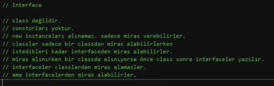
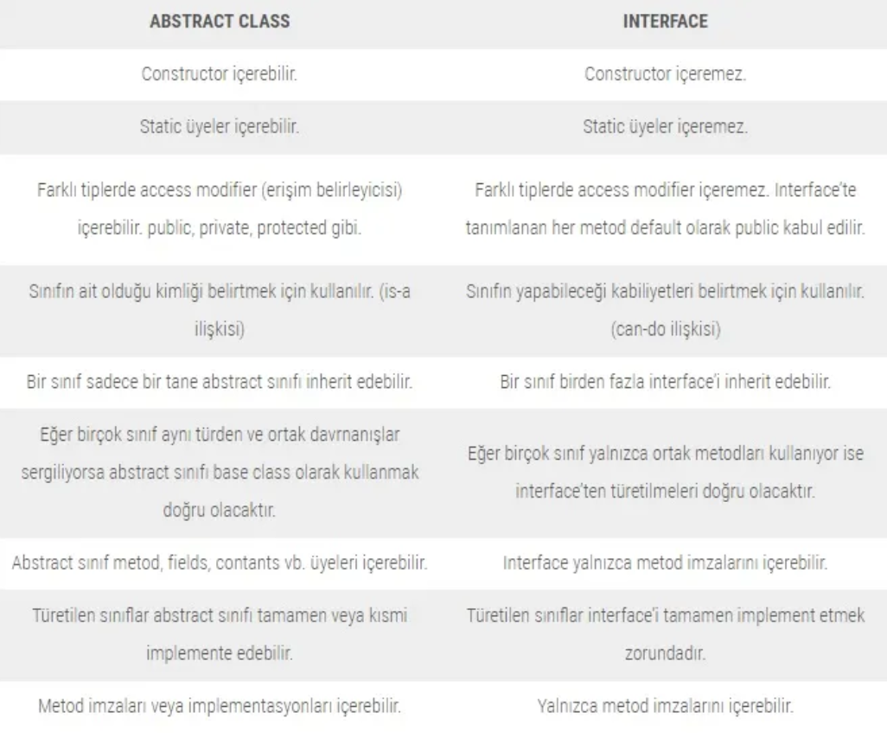

# C# OOP

## OOP(Object Oriented Programming)

* Nesne Yönelimli Programlama‘nın temel amacı gün geçtikçe ilerleyen ve genişleyen yazılım sektöründeki bir takım problemlere ve tıkanıklıklara çözüm üretmektir.Ana mantık, mevzu bahis konuların classlar ile soyutlanarak hem bilgisayarın hem de insanların anlayabileceği modeller oluşturmaktır.
Programlarımızda OOP kullanarak, daha güvenli olma, daha kolay kontrol etme ve yanlış sonuçları anında tespit etme, böylece daha kolay kod blokları yazma fırsatına sahip oluruz.

### OOP özellikleri
* Abstraction (Soyutlama)
* Encapsulaation (Kapsülleme)
* Inheritance (Miras Alma / Kalıtım)
* Polymorphism (Çok Biçimlilik)

## Class

* Classlar bizim yapmak isteğimiz işlemleri gruplara ayırmak, o grup üzerinden işlemlerimizi yapmak ve rahatlıkla bu gruba ulaşmak için kullanabilirz.
-- bir class’ı kullanabilmek için onun örneğini(referansını) oluşturmamız gerekmektedir.
-- bir class oluştururken kelimenin ilk harfi büyük oluşturulur. Ama örneği oluşturulduğunda ilk harfi küçük, sonraki kelimelerin ilk harfi büyük yazılır.Classlar bir gruplama tekniği olarak metodlar ile kullanılabilir.
* Classların bir diğer özelliği property dediğimiz nesneleri(özellikleri) tutmasıdır.
* Property olarak tanımladığımız classlarımızdaki get ve set dediğimiz bloklar, encasulation tekniklerinin en temel versiyonu ile kullanılır.
* Bir field üzerinde get veya set ederken yani değeri verirken veya değeri okurken başka bir şey yapmak istersek encapsulation tekniğini kullanmamız gereklidir.

### Property Nedir?

* Property’ler değişkenlerin gelişmiş metot halidir. Kısacası değişken/data üzerinde kontroller veya doğrulama işlemleri yapabilerek datayı saklama ve sunma olanağı gösteren yapılardır.

Diğer bir deyişle property (özellik), değişken ve metodun birleşimi gibidir ve bu saklama ve sunma işlemini sahip olduğu iki özelliği ile gerçekleştirir Get ve Set.

Get: Datayı değişken üzerinden okurken kullandığımız metot.

Set: Datayı değişken üzerine yüklerken kullandığımız metot.

* Field, alan yada veri olarak tanımlayabiliriz.
Property, bir sınıfın fieldlarına erişim sağlamak için kullanılan bir sınıf üyesi türüdür, “set” ve “get” metodlarını içerir.

```C#
public class Member
{
    private string _name; //Field
    public string Name   //Property
    {
        get { return _name; }
        set { _name = value; }
    }
}
```
```C#
public class Product //public olduğunu belirtmezsek internal olur
{

		//field
		int b; //field
			   //fieldlar hep private olarak kalır


		int _c;

        //propertyler hiçbir zaman içerisinde veri tutmazlar
		//ramdeki bir değeri getirirler
        public int c {
			get
			{
				return _c;
			} //getirmek
			set
			{
				_c = value;
			} //atamak
		} 


        public Product()
		{
			int a = 25; //local variable
			int b= a; //a'yı çağırmış olduk

			c = 12;
			Console.WriteLine(_c);
			Console.WriteLine(c);
		}
}
```


```C#
public class Car
{
        //Property=>arabanın nesi var?
        public string Brand { get; set; }
        public string Model { get; set; }
        public  string Color { get; set; }
        public  int Speed { get; set; }
        public int Gear { get; set; }

        //Metot=>ne yapabilir?
        
}
```

### Instance almak:

```C#
Car car = new Car();
```


### Access Modifiers

C# da sınıflar içerisinde, değişkenlere, metodlara ve diğer üyelere erişim sağlarken yada erişimi yasaklarken access modifiers kullanılır.

5 adet access modifiers vardır ; public, private, protected, internal ve protected internal.

1. public: class üyelerine her yerden erişim açıktır.
2. private: class üyelerine sadece class içinde erişim sağlanabilir.
3. protected: class üyelerine class içerisinde veya bu class’tan türemiş classlardan erişim sağlanabilir.
4. internal: class üyelerine sadece aynı assembly (proje) içerisinde erişim sağlanabilir.
5. protected internal: class üyelerine aynı assembly (proje) içerisinde yada bu classtan türetilmiş class içerisinde erişim sağlanabilir.

### Constructors nedir ?
Constructor bir object yaratıldığında otomatik olarak çalışır.

Constructor metodunun ismi class ismi ile aynı olmalıdır.
Constructor void olamaz.
Constructor’ın return type’ ı yoktur.
Constructor metodlar overload edilebilirler.
“this” anahtar kelimesi ile constructor metodumuzu çağırabiliriz.

### Overloading nedir ?
Overloading, aynı isme sahip fakat farklı signatureları olan metodları oluşturmadır.

### Signature nedir ?
Signature, bir metodun içerdiği parametrelerin sayısı, tipi ve sırasıdır.

### Default Constructor nedir ?
Hiç parametresi olmayan constructor metoduna default constructor denir.

```C#
public Car()
{
	ProductionDate = DateTime.Now;
}
public Car(string _Brand)
{
	Brand = _Brand;
}
```

### OOP özellikleri

1. Encapsulaation (Kapsülleme):
* Encapsulation, sınıf içerisindeki field ve davranışları gizleme yeteneğini ifade eder, bu field başka sınıflar içerisinden erişilemez ancak property vasıtasıyla erişilebilir.
```C#
public class User
{
        public User(string _UserName, string _Password)
        {
            UserName = _UserName;
            Password = _Password;
        }

        string _password;

        public string UserName { get; set; }
        public string Password
        {
            get
            {
                return _password;
            }
            set
            {
                if (value.Length < 4)
                {
                    Console.WriteLine("Password en az dört karakter olmalıdır.");
                }
                else
                {
                    _password = value;
                }
            }
        }
}
```

2. Inheritance(Kalıtım)
* Biri diğerinden türeyen classlar arasındaki ilişkiye inheritance diyebiliriz.

* İki class arasında Is-A ilişkisi vardır ; A Car is a Vehicle.

```C#
public class Car : Vehicle { }
```
* Inheritance bize yazılan codu tekrar kullanma ve polimorfik yapılar oluşturma avantajları sunar fakat aynı zamanda classlar arasında tightly coupled ilişkiside oluşur.
* Bir sınıf sadece bir sınıftan kalıtım alır ama birden fazla kalıtım verebilir.

```C#
public class Character
{
		public string CharacterName { get; set; }
		public int Damage { get; set; }
		public int Armor { get; set; }

		protected void Walk()
		{
			Console.WriteLine("Kırlarda yürüyorum");
		}
}
```

```C#
public class Archer:Character
{
        public Archer()
        {
            Walk();
            Damage = 3;
        }
}
```
```C#
public class Wizard : Character
{

		public int DoMagic(int damage)
		{
			return damage * 5;
		}
}
```

3. Abstraction (Soyutlama)

* Abstract class, instance edilemeyen özel bir class türüdür. Bazen class üyelerini base classda implement etmek doğru olmayabilir böyle bir durumda abstract class kullanmak gerekir.

```C#
public abstract class Shape
{
 public abstract Draw();
}
public class Square: Shape
{
 public override Draw()
 {
 }
}
```
* Abstract class içerisinde içi boş abstract metodlar tanımlanabilir, bu metodlar alt classlar tarafından override edilmek zorundadır.
* Abstract class dan miras alınır ama instance edilmez.

```C#
Shape shape = new Shape(); //Hata
```

```C#
public abstract class Shape
{
		public int Edge { get; set; }
		public int Area { get; set; }
		public int Length { get; set; }

}
```

```C#
public class Square:Shape
{

}
```

4. Polymorphism (Çok Biçimlilik)

* Inherit edilen class’ın metodu override edilebilir, bu şekilde inherit edilen classlarda metodların değiştirilerek kunllanılmasına polimorfizm denir.

```C#
public class Character
{
		public string CharacterName { get; set; }
		public int Damage { get; set; }
		public int Armor { get; set; }

		public virtual void Attack()
		{
			Console.WriteLine("Normal saldırı yap");
		}
}
```
```C#
public class Archer:Character
{
        public Archer()
        {
            Damage = 3;
        }

		public override void Attack()
		{
			Console.WriteLine("Ok ile saldır");
		}
}
```

### Sealed (Mühürlü) Class Nedir?

* Sealed Class nesne yönelimli programlamanın kalıtım özelliğini kısıtlamak için kullanılır.

* Sealed keywordü bir class ve metod modifier(niteleyici)dır. Eğer bir class sealed komutuyla işaretlenmişse o classtan kalıtım yapılamaz. Yani o class başka bir sınıfın base classı olamaz. Ayriyetten bir metod sealed komutuyla işaretleniyorsa o metodtan türetilen sınıfların ilgili metodu override etmeleri önlenir.

```C#
public sealed class Archer:Character
{
        public Archer()
        {
            Damage = 3;
        }

		public override void Attack()
		{
			Console.WriteLine("Ok ile saldır");
		}
}
```

```C#
public class Archer:Character
{
        public Archer()
        {
            Damage = 3;
        }

		public sealed override void Attack() //Bu sınıfı kalıtım alan sınıf tarafından override edip değiştiremesin diye sealed kullanıldı.
		{
			Console.WriteLine("Ok ile saldır");
		}
}
```
### Interface Nedir?

* Arayüz nesne yönelimli programlama dillerinde, farklı sınıflardan nesnelerin kategorize edilmesini sağlayan soyut bir tür çeşitlerinden biridir.Interface’ler bir class olarak kabul edilmemektedir fakat buna rağmen bir class gibi ve/veya abstract class gibi referans tutabilmektedir. Başka bir yaklaşımla abstract sınıflar tarafından sunulan abstraction’ın bir adım ileri taşınmış halidir interface. 
* Abstract class da yer alan metodlar metod imzasını verir metodun implementasyonunu ise subclass’a bırakır. Yani yolu gösterir ama yolda nasıl ilerleyeceğini göstermez. İşte tam da bu noktada interface’ler farklı bir görev üstlenmektedir. Interface’ler kendi bağlamından üretilen sınıflar için bir kılavuz, yol gösterici veya gerçekleştirilmesi gereken görevler bütünü olarak tanımlamak yerinde bir yaklaşım olacaktır.
* class değildir, constructorları yoktur.
* new instanceları alınamaz sadece miras verebilirler.
* classlar istedikleri kadar interfaceden miras alabilirler.



```C#
public interface IAnimal
{
		void Voice();
}
```

```C#
public abstract class BaseClass
{
		public string Name { get; set; }
}
```

```C#
public class Dog : BaseClass, IAnimal
{
		public void Voice()
		{
			Console.WriteLine("Hav hav");
		}
}
```

### Abstract Class ve Interface Arasındaki Farklar Nelerdir?

